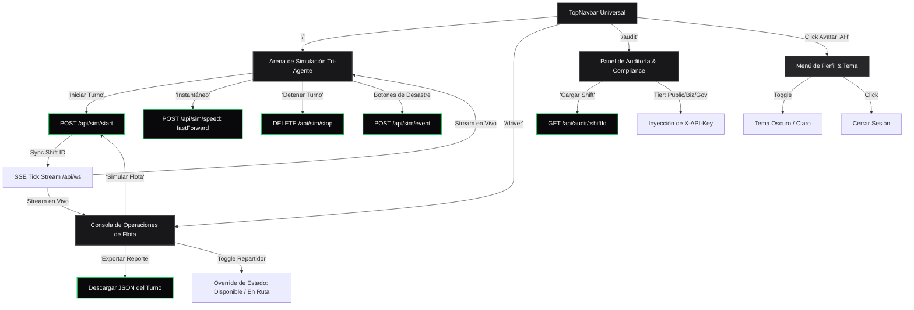
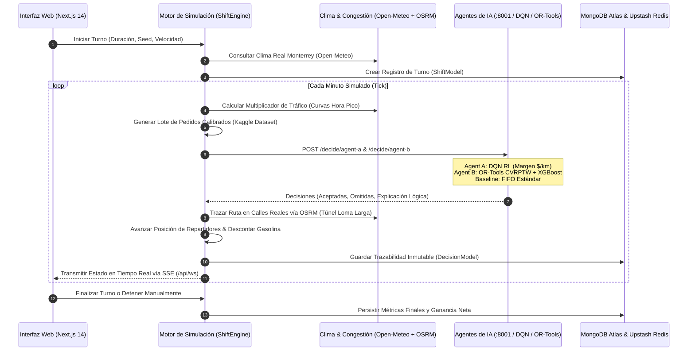

# DeliMan — Manual de Uso, Flujo de Navegación & Pitch Playbook

> **Guía Oficial de Operación, Catálogo de Acciones y Guión de Demostración para Jueces e Inversionistas**  
> **Proyecto**: *DeliMan — Motor de Optimización Multi-Agente en Tiempo Real para Monterrey*  
> **HackMTY 2026** — *Infosys Challenge #3*

---

## 1. Diagrama de Flujo del Sistema (Flowchart)

### A. Mapa de Pantallas y Navegación

---

### B. Ciclo de Decisión Multi-Agente por Tick

---

## 2. Catálogo Completo de Botones y Acciones

### Pantalla 1: Arena de Simulación Tri-Agente (`/`)

| Elemento / Botón | Ubicación | Acción Interna | Efecto Visual en Pantalla |
| :--- | :--- | :--- | :--- |
| **Selector de Duración** | Cabecera superior | Ajusta la duración del turno (60, 120, 240, 480 ticks/minutos). | Define el límite de tiempo del turno a simular. |
| **Selector de Velocidad** | Cabecera superior | Envía `POST /api/sim/speed/[id]` con `tickSpeedMs`. | Modifica la velocidad del reloj (1x, 2x, 5x, 10x, 20x, Ultra 10ms, Flash 0ms). |
| **"Iniciar Turno"** | Cabecera superior | Dispara `POST /api/sim/start` y guarda `shiftId` en `localStorage`. | Inicia la animación de repartidores, flujo de pedidos y gráficos en vivo. |
| **"Instantáneo"** | Cabecera superior | Dispara `POST /api/sim/speed/[id]` con `{ fastForward: true }`. | Computa los 480 ticks del turno completo al instante, mostrando el resultado final. |
| **"Detener Turno"** | Cabecera superior | Dispara `DELETE /api/sim/stop/[id]`. | Frena el turno activo, consolida datos en MongoDB y resetea el estado. |
| **" Surge 2.5x"** | Banner de Contingencias | Inyecta evento de alta demanda en Centrito Valle (San Pedro). | Círculo ámbar pulsante en el mapa; tarifas suben $2.5\times$. |
| **" Inundación Constitución"** | Banner de Contingencias | Inyecta cierre por inundación en Par Vial Constitución / Félix U. Gómez. | Círculo rojo; velocidad cae a $4\text{ km/h}$ obligando a los agentes a rodear. |
| **" Clásico Regio BBVA"** | Banner de Contingencias | Inyecta surge masivo ($3.0\times$) en Guadalupe / La Pastora. | Ráfaga de pedidos de alto ticket en zona estadio. |
| **" Tormenta Torrencial"** | Banner de Contingencias | Inyecta tormenta metropolitana en cuenca Río Santa Catarina. | Círculo azul cielo; -40% velocidad general y propinas más altas. |
| **" Bloqueo Gonzalitos"** | Banner de Contingencias | Inyecta mega obra y cierre de carriles en Gonzalitos & Fleteros. | Alerta naranja; embotellamiento en la arteria norte-sur. |
| **" Riesgo Independencia"** | Banner de Contingencias | Inyecta zona de riesgo e inseguridad en Col. Independencia. | Círculo morado; penalización de -$45 MXN por incidente para agentes descuidados. |
| **Mapa Interactivo Leaflet** | Centro de pantalla | Renderizado con tiles oscuros de CartoDB / OSM y capas vectoriales. | Controles de Zoom (+ / -), arrastre, visualización de rutas OSRM y calor. |
| **Pines de Restaurantes** | En el mapa | Marcadores interactivos con ícono gastronómico. | Popup con nombre real, corredor, ticket promedio MXN y tiempo de cocina Kaggle. |
| **Pines de Agentes (A, B, Base)** | En el mapa | DivIcons animados con pulso en tiempo real. | Popup con estado operativo, ganancia bruta, costo combustible y ganancia neta. |

---

### Pantalla 2: Consola de Operaciones de Flota (`/driver`)

| Elemento / Botón | Ubicación | Acción Interna | Efecto Visual en Pantalla |
| :--- | :--- | :--- | :--- |
| **"Simular Flota"** | Cabecera derecha | Inicia o detiene la simulación conectada con el despachador. | Pasa los repartidores a estado de servicio y actualiza KPIs. |
| **"Filtrar repartidores..."** | Tabla de repartidores | Filtro reactivo en tiempo real por texto. | Filtra instantáneamente por ID (`REP-4091`), nombre o zona asignada. |
| **"Disponible" / "En Ruta"** | Filas de la tabla | Alterna el estado manual del repartidor (`manualOverrides`). | Cambia el botón de estilo gris claro a blanco activo para pruebas de despacho. |
| **"Ver Simulación y Mapa"** | Tarjeta de Acciones | Enlace Next.js hacia `/`. | Regresa al mapa general interactivo. |
| **" Alertar a la Flota"** | Tarjeta de Acciones | Disparador de alerta de radio / broadcast. | Muestra alerta informativa de tráfico pesado en Gonzalitos y Morones. |
| **" Exportar Reporte"** | Tarjeta de Acciones | Genera un archivo Blob JSON con toda la telemetría del turno. | Descarga el archivo `courier_shift_report_[shiftId].json` a tu equipo. |
| **"Panel de Auditoría"** | Tarjeta de Acciones | Enlace Next.js hacia `/audit`. | Navega al panel de gobernanza y compliance. |

---

### Pantalla 3: Panel de Auditoría & Compliance (`/audit`)

| Elemento / Botón | Ubicación | Acción Interna | Efecto Visual en Pantalla |
| :--- | :--- | :--- | :--- |
| **"Cargar Shift"** | Barra de inspección | Realiza `GET /api/audit/[shiftId]` con la API Key activa. | Carga los registros de decisiones algorítmicas desde MongoDB Atlas o memoria. |
| **"Shift Activo: [id]"** | Barra de inspección | Detecta automáticamente el turno en curso en `localStorage`. | Llena el campo de texto y carga las decisiones con un solo clic. |
| **Nivel "PUBLIC"** | Selector de Clearance | Consulta los registros sin cabecera de autenticación. | Visualiza estadísticas agregadas y conteo de órdenes aceptadas/omitidas. |
| **Nivel "BUSINESS"** | Selector de Clearance | Inyecta cabecera `X-API-Key: courier_biz_2026`. | Desbloquea la explicación en lenguaje natural del razonamiento de cada decisión. |
| **Nivel "GOV AUDITOR"** | Selector de Clearance | Inyecta cabecera `X-API-Key: courier_gov_2026`. | Desbloquea el payload algorítmico crudo, vectores de pesos y certificación Zero-LLM. |
| **"Fetch Audit"** | Barra de API Key | Permite ingresar llaves personalizadas para pruebas de seguridad. | Valida clearance y políticas de rate-limiting (120 req/min). |

---

## 3. Guión de Presentación para Jueces e Inversionistas (3 Minutos)

### Minuto 1: El Problema en Monterrey (0:00 - 0:45)
1. **Acción**: Abre la pantalla principal `/` y haz clic en **"Iniciar Turno"** a velocidad `1x` o `2x`.
2. **Pitch**:
   > *"En las aplicaciones tradicionales de delivery como Uber Eats o Rappi, las órdenes se asignan mediante colas FIFO (First-In, First-Out) completamente ciegas a la física urbana de Monterrey:*
   > - *Atrapan a los repartidores en Av. Gonzalitos a 10 km/h en hora pico por órdenes de $30 pesos.*
   > - *Los hacen esperar 25 minutos en cocinas lentas sin percibir ingresos.*
   > - *Ignoran barreras orográficas como la Loma Larga y mandan rutas en línea recta que no se pueden cruzar.*
   > > *El resultado: los repartidores pierden hasta un 40% de sus ingresos netos y las plataformas sufren cancelaciones masivas."*

---

### Minuto 2: La Solución Tri-Agente y Física Real (0:45 - 1:45)
1. **Acción**: Señala las 3 tarjetas de agentes en el dashboard y el mapa interactivo:
   - **Agent A (The Economist — DQN Reinforcement Learning)**: Maximiza margen por kilómetro ($16+/km) rechazando viajes con aproximaciones vacías (*deadhead*).
   - **Agent B (The Hustler — Google OR-Tools CVRPTW + XGBoost)**: Maximiza volumen por hora agrupando hasta 3 pedidos en clusters hiperlocales.
   - **Baseline (App Tradicional — FIFO Naive)**: Acepta todo lo que entra.
2. **Acción en vivo**: Haz clic en **" Inundación Constitución"** y luego en **" Surge 2.5x"**.
3. **Pitch**:
   > *"Vean lo que sucede en tiempo real: inyectamos una inundación en Par Vial Constitución. Agent A y Agent B detectan la caída de velocidad a 4 km/h y rechazan o rodean la zona a través de rutas reales de OSRM por el Túnel de la Loma Larga. Mientras tanto, el Baseline tradicional entra directo a la inundación, queda atrapado y destruye su rentabilidad horaria."*

---

### Minuto 3: Resultados Financieros y Gobernanza Zero-LLM (1:45 - 3:00)
1. **Acción**: Haz clic en el botón **"Instantáneo"** para completar los 480 minutos del turno al instante.
2. **Pitch Financiero**:
   > *"Con 'Instantáneo' simulamos un turno completo de 8 horas en milisegundos:*
   > - *El **Agent B (The Hustler)** generó **+$620 MXN netos** vs **$310 MXN** de la app tradicional: un **incremento del +100% en ingresos netos** para el repartidor.*
   > - *El costo de combustible ($0.70/km) se redujo un 30% gracias al ruteo inteligente por corredores viales."*
3. **Acción**: Haz clic en **"Panel de Auditoría"** en la barra superior o en `/audit`. Clic en **"Shift Activo"** y luego en **"Gov Auditor"**.
4. **Pitch de Compliance & Enterprise**:
   > *"A diferencia de sistemas opacos que usan LLMs lentos y costosos, DeliMan utiliza una arquitectura **Zero-LLM Runtime**. Cada decisión matemática es 100% determinista, explicable, auditable bajo 3 niveles de seguridad (Public, Business, Gov) y respaldada en MongoDB Atlas.*
   > *Esto hace a DeliMan la primera plataforma de optimización logística lista para certificación regulatoria empresarial y adopción masiva en flotas urbanas."*
5. **Cierre**: En `/driver`, haz clic en **"Exportar Reporte de Turno (JSON)"** para mostrar la descarga de telemetría completa.

---

## 4. Parámetros Calibrados con el Dataset Kaggle

Los tiempos de cocina y dinámicas de propinas no son inventados; provienen del dataset empírico de Food Delivery:

- **Tiempos de Cocina por Categoría**:
  - `snack` (cafeterías, panaderías): 5 a 8 minutos.
  - `fast_food` (tacos, hamburguesas): 10 a 16 minutos.
  - `casual_dining` (comida mexicana, italiana): 18 a 26 minutos.
  - `buffet_gourmet` (cortes, alta cocina): 25 a 35 minutos.
- **Costos y Penalizaciones Reales**:
  - Costo de combustible por km recorrido: **$0.70 MXN/km**.
  - Penalización por extravío o incidente en zona de riesgo: **-$45.00 MXN**.
  - Ruteo obligatorio a través del Túnel de la Loma Larga para viajes San Pedro $\leftrightarrow$ Monterrey Centro.